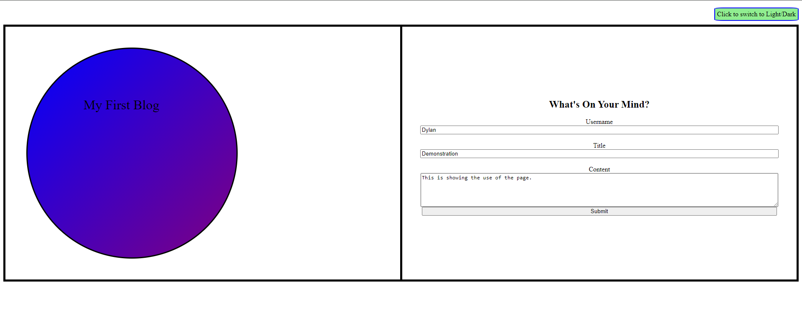
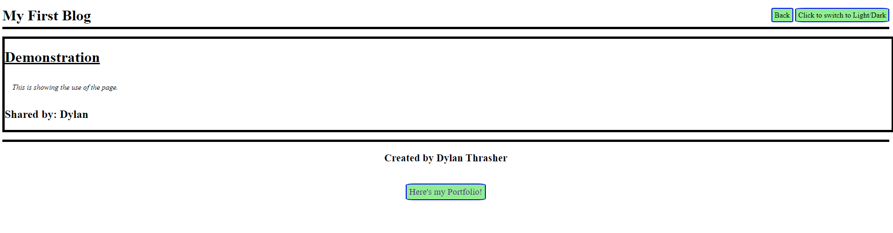

# My_First_Blog
A blog for people to enter brief stories that they'd like to share with others and also want to see others posts. 

## Description
This project was created in order to provide practice for storing information locally and posting the information in another webpage, while demonstrating the efficiency of having separate files for repeated code that can apply to multiple pages.

## Usage
The page opens to a form for entering a username, title, and content. In the event that any field is blank, the page will prevent moving forward to the posted blogs. Once all fields are completed and the submit button is pressed, it will change to a page that displays all of the attempted submissions on the user's machine. The results page also features functional links to the previous page to enter more information, or to the creator's portfolio to demonstrate other projects. Both pages also feature a button to switch between light and dark modes.
 Please feel free to view the results on the [finished page](https://dylan-thrasher.github.io/My_First_Blog/).

 
 